# esoc-chart

High-level charting library for Rust. Built on [esoc-gfx](../esoc-gfx/) and designed as a matplotlib-equivalent for ML workflows.

## Gallery

<table>
<tr>
<td>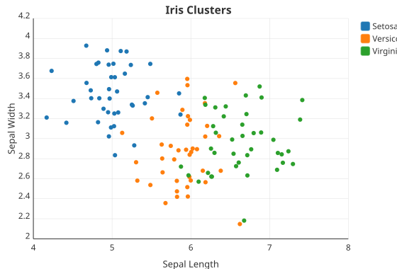</td>
<td>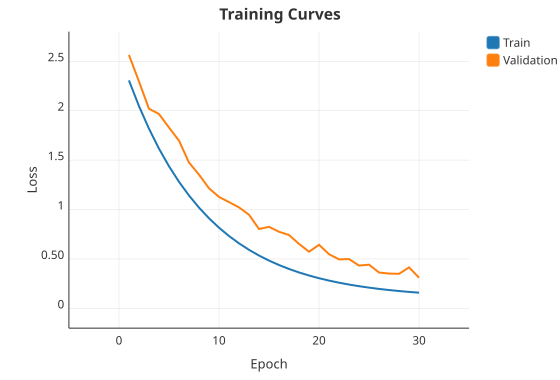</td>
</tr>
<tr>
<td>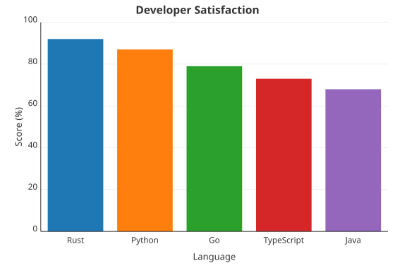</td>
<td>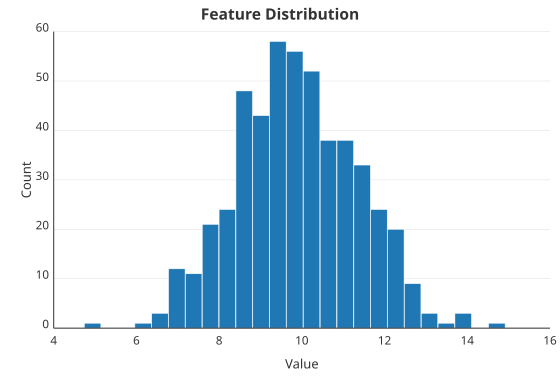</td>
</tr>
<tr>
<td>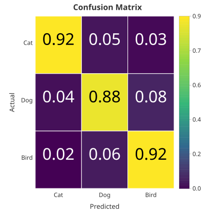</td>
<td>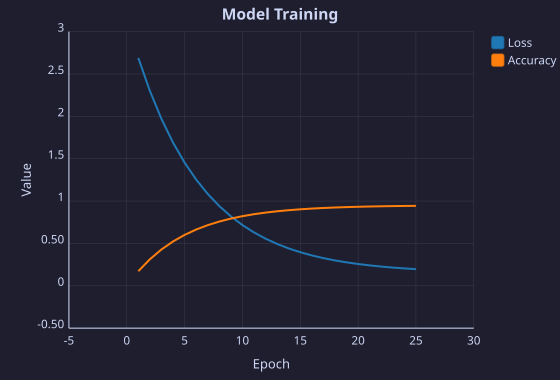</td>
</tr>
<tr>
<td>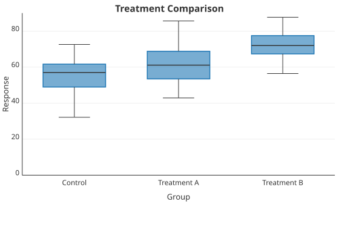</td>
<td>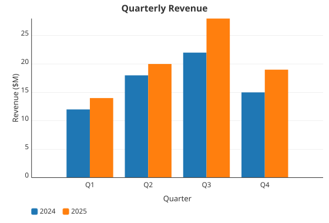</td>
</tr>
<tr>
<td>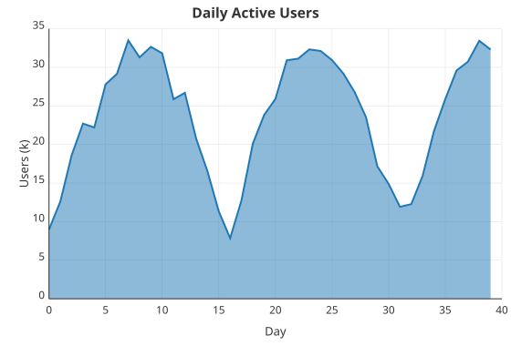</td>
<td>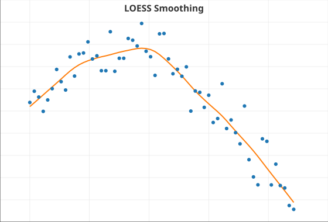</td>
</tr>
<tr>
<td>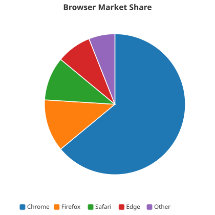</td>
<td>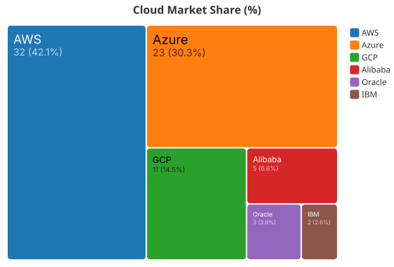</td>
</tr>
</table>

## Quick Start

```toml
[dependencies]
esoc-chart = { path = "crates/esoc-chart" }
```

```rust
use esoc_chart::express::scatter;

fn main() -> esoc_chart::error::Result<()> {
    let x = vec![1.0, 2.0, 3.0, 4.0, 5.0];
    let y = vec![2.3, 4.1, 3.0, 5.8, 4.9];

    scatter(&x, &y)
        .title("My First Chart")
        .x_label("X")
        .y_label("Y")
        .save_svg("chart.svg")?;

    Ok(())
}
```

## API Levels

esoc-chart provides three levels of abstraction:

### Express API

One-liner functions for common chart types. Every builder supports `.title()`, `.x_label()`, `.y_label()`, `.size()`, `.theme()`, `.to_svg()`, and `.save_svg()`.

```rust
use esoc_chart::express::*;

// Scatter plot with category coloring
scatter(&x, &y)
    .color_by(&categories)
    .title("Clusters")
    .save_svg("scatter.svg")?;

// Bar chart
bar(&["Rust", "Go", "Python"], &[92.0, 79.0, 87.0])
    .title("Satisfaction")
    .save_svg("bar.svg")?;

// Histogram with custom bin count
histogram(&values)
    .bins(25)
    .title("Distribution")
    .save_svg("hist.svg")?;

// Grouped and stacked bars
grouped_bar(&categories, &groups, &values)
    .title("Revenue by Quarter")
    .save_svg("grouped.svg")?;

stacked_bar(&categories, &groups, &values)
    .title("Revenue by Segment")
    .save_svg("stacked.svg")?;

// Pie and donut
pie_labeled(&["A", "B", "C"], &[40.0, 35.0, 25.0])
    .title("Share")
    .save_svg("pie.svg")?;

pie_labeled(&labels, &values)
    .donut(0.5)
    .save_svg("donut.svg")?;

// Box plot, area, heatmap, treemap
boxplot(&categories, &values).save_svg("box.svg")?;
area(&x, &y).save_svg("area.svg")?;
heatmap(matrix).annotate().save_svg("heat.svg")?;
treemap(&labels, &values).save_svg("tree.svg")?;
```

### Grammar of Graphics API

Composable `Chart` / `Layer` system for full control. Combine multiple marks, apply statistical transforms, and use annotations.

```rust
use esoc_chart::grammar::chart::Chart;
use esoc_chart::grammar::layer::{Layer, MarkType};
use esoc_chart::grammar::stat::Stat;
use esoc_chart::grammar::annotation::Annotation;

// Multi-series line chart
let chart = Chart::new()
    .layer(
        Layer::new(MarkType::Line)
            .with_x(epochs.clone())
            .with_y(train_loss)
            .with_label("Train"),
    )
    .layer(
        Layer::new(MarkType::Line)
            .with_x(epochs)
            .with_y(val_loss)
            .with_label("Validation"),
    )
    .title("Training Curves")
    .x_label("Epoch")
    .y_label("Loss")
    .size(600.0, 400.0);

chart.save_svg_to("training.svg")?;
```

```rust
// Scatter with LOESS trend line
let chart = Chart::new()
    .layer(
        Layer::new(MarkType::Point)
            .with_x(x.clone())
            .with_y(y.clone())
            .with_label("Data"),
    )
    .layer(
        Layer::new(MarkType::Line)
            .with_x(x)
            .with_y(y)
            .stat(Stat::Smooth { bandwidth: 0.3 })
            .with_label("LOESS"),
    )
    .title("Smoothed Trend")
    .annotate(Annotation::hline(threshold).with_label("Target"));
```

### Scene Graph

Direct access to the underlying `esoc-scene` scene graph for advanced customization. Charts compile down to `esoc_scene::SceneGraph`, which renders through `esoc-gfx`.

## Chart Types

| Type | Express function | Mark |
|------|-----------------|------|
| Scatter | `scatter()` | `Point` |
| Line | `line()` | `Line` |
| Bar | `bar()` | `Bar` |
| Grouped Bar | `grouped_bar()` | `Bar` + `Dodge` |
| Stacked Bar | `stacked_bar()` | `Bar` + `Stack` |
| Horizontal Bar | grammar API + `CoordSystem::Flipped` | `Bar` |
| Histogram | `histogram()` | `Bar` + `Bin` |
| Area | `area()` | `Area` |
| Box Plot | `boxplot()` | `Bar` + `BoxPlot` |
| Pie | `pie_labeled()` | `Arc` |
| Donut | `pie_labeled().donut(0.5)` | `Arc` |
| Heatmap | `heatmap()` | `Heatmap` |
| Treemap | `treemap()` | `Treemap` |

## Statistical Transforms

Apply transforms via `Layer::stat()`:

- **`Stat::Bin { bins }`** -- histogram binning with pretty breaks
- **`Stat::BoxPlot`** -- quartiles, whiskers, outliers
- **`Stat::Smooth { bandwidth }`** -- LOESS local regression
- **`Stat::Aggregate { func }`** -- count, sum, mean, median, min, max

## Themes

Three built-in themes, fully customizable:

```rust
use esoc_chart::new_theme::NewTheme;

// Built-in themes
NewTheme::light()       // white background, gray grid (default)
NewTheme::dark()        // dark background, muted grid
NewTheme::publication() // clean serif font, no grid

// Apply to any chart
scatter(&x, &y)
    .theme(NewTheme::dark())
    .save_svg("dark.svg")?;
```

Themes control background, foreground, grid, palette, typography, and mark sizing.

## Annotations

Add reference lines, bands, and text labels:

```rust
use esoc_chart::grammar::annotation::Annotation;

let chart = scatter(&x, &y)
    .build()
    .annotate(Annotation::hline(50.0).with_label("Target"))
    .annotate(Annotation::vline(10.0).with_label("Cutoff"))
    .annotate(Annotation::band(40.0, 60.0))
    .annotate(Annotation::text(5.0, 55.0, "Safe zone"));
```

Express builders also support `.hline()` and `.vline()` directly.

## Faceting

Split data into small multiples:

```rust
scatter(&x, &y)
    .facet_wrap(&panel_labels, 2)  // 2 columns
    .save_svg("facets.svg")?;
```

## Position Adjustments

Control how overlapping marks are arranged:

- **`Position::Stack`** -- stack bars/areas vertically
- **`Position::Dodge`** -- place side by side
- **`Position::Fill`** -- normalize to 100%
- **`Position::Jitter { x_amount, y_amount }`** -- add random displacement

## Output Formats

```rust
// SVG string
let svg: String = chart.to_svg()?;

// Save to file
chart.save_svg_to("chart.svg")?;

// PNG (requires `png` feature)
chart.save_png_to("chart.png")?;
```

## Features

| Feature | Description |
|---------|-------------|
| `png` | Enable PNG output (via esoc-gfx) |
| `scry-learn` | ML integration: confusion matrices, ROC curves, dataset scatter |

## scry-learn Integration

With the `scry-learn` feature, plot ML results directly:

```rust
use esoc_chart::interop::*;

// From a trained model's confusion matrix
let svg = confusion_matrix.to_chart().to_svg()?;

// ROC curve from predictions
let svg = roc_curve_figure(&y_true, &y_scores)?.to_svg()?;

// Scatter a dataset with class coloring
let svg = scatter_dataset(&dataset)?.to_svg()?;
```

## Examples

Run the gallery to see all chart types rendered to an HTML page:

```bash
cargo run -p esoc-chart --example gallery
open chart_gallery.html
```

Individual examples:

```bash
cargo run -p esoc-chart --example basic_scatter
cargo run -p esoc-chart --example basic_bar
cargo run -p esoc-chart --example basic_line
cargo run -p esoc-chart --example scatter_categories
cargo run -p esoc-chart --example basic_treemap
```

## License

MIT OR Apache-2.0
