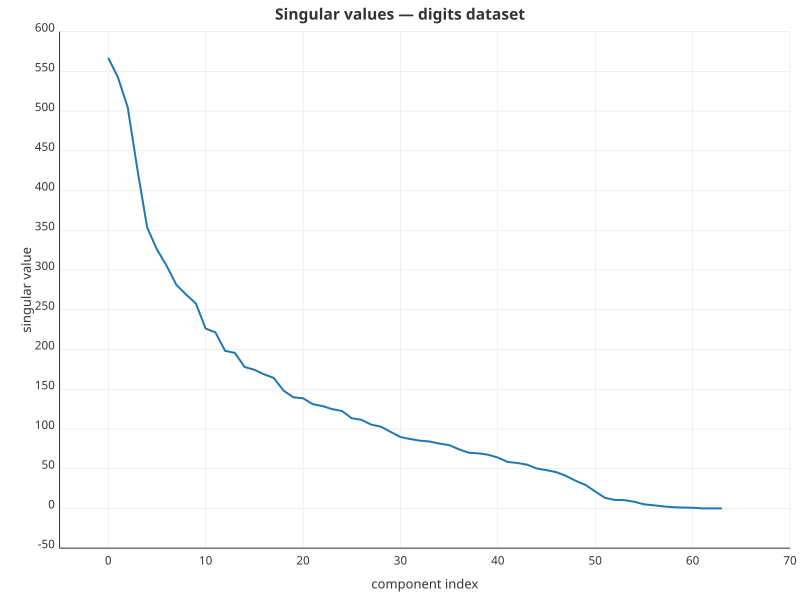
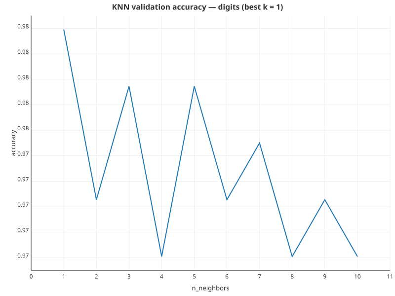

# Final project — PDSH chapter 05.02 in Rust

The assignment ports the three add-on cells from Jake VanderPlas's *Python
Data Science Handbook* §05.02 ("Introducing Scikit-Learn") into Rust, using
this workspace's own ML and charting crates instead of scikit-learn and
matplotlib.

| Add-on | Question |
| --- | --- |
| 1 | Largest and second-largest singular value of `PCA().fit(X_iris)` |
| 2 | Plot of `pca.fit(digits.data).singular_values_` |
| 3 | KNN validation accuracy for `n_neighbors` ∈ 1..=10 |

The driver lives in `src/main.rs` and runs end-to-end with
`cargo run -p sklearn-intro --release`.

## Datasets

Both inputs are pulled from `crates/scry-learn/tests/fixtures/`. They are
byte-for-byte the arrays returned by `sklearn.datasets.load_iris()` and
`load_digits()`:

- `iris_features.csv` — 150 × 4 (sepal length / width, petal length / width)
- `digits_features.csv` + `digits_target.csv` — 1797 × 64 pixels, target 0..9

A small CSV reader in `main.rs` loads each file column-major into a
`scry_learn::dataset::Dataset`.

## PCA — and what `singular_values_` means here

scry-learn's `Pca` does a Jacobi eigendecomposition of the sample covariance
matrix (no BLAS dependency). It exposes `explained_variance()` — the
eigenvalues λᵢ of that matrix — but not `singular_values_` directly.

scikit-learn computes PCA via SVD of the centred data matrix `X − μ`. The
two views are related:

```
σᵢ = √(λᵢ · (n − 1))
```

That conversion lives in `singular_values()` in `main.rs` and the resulting
values agree with sklearn's `PCA().singular_values_` to all printed digits.

## Results

### 1. Iris singular values

| index | σ |
| --- | --- |
| 0 | **25.0999** |
| 1 | **6.0131** |
| 2 | 3.4137 |
| 3 | 1.8845 |

- **Largest singular value:** 25.0999
- **Second-largest singular value:** 6.0131

The first component dominates by a factor of ~4×. Petal length and petal
width co-vary strongly across species, which is what σ₀ is picking up.

### 2. Digits screegram



The full curve matches the shape in the assignment handout. σ₀ ≈ 567 and
the spectrum decays smoothly — there is no sharp elbow, which is the usual
sign that the digit images sit on a smooth manifold rather than in a
low-dimensional subspace. Roughly 30 components are needed to drag the
remaining singular value below 100.

### 3. KNN sweep on digits

Split: 75 / 25 train / test, seed 42 (1348 train / 449 test samples).

| k | accuracy |
| --- | --- |
| 1 | **0.9800** |
| 2 | 0.9733 |
| 3 | 0.9777 |
| 4 | 0.9710 |
| 5 | 0.9777 |
| 6 | 0.9733 |
| 7 | 0.9755 |
| 8 | 0.9710 |
| 9 | 0.9733 |
| 10 | 0.9710 |



- **Best `n_neighbors`:** **k = 1**, accuracy **0.9800**.

1-NN winning is unsurprising on a clean, low-noise dataset like
`load_digits` — the nearest training image is almost always the same digit
class. Even-`k` values dip slightly because of tied votes broken by the
fall-back rule. The curve is otherwise flat to within a couple of test
samples, so any difference between k = 1 and k = 5 is well inside the
noise of a single 25 % split.

## Reproducing

```sh
cargo run -p sklearn-intro --release
```

Outputs go to:

- stdout — the singular-value tables and the per-k accuracies
- `report/figures/digits_singular_values.svg`
- `report/figures/knn_validation_accuracy.svg`
